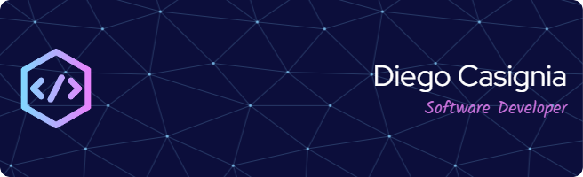

# 💫 About Me:
I'm a Software Engineering student at Universidad de las Fuerzas Armadas "ESPE". I'm a passionate about software development and cybersecurity.

# 🌐 Socials:
  

# ✅ Skills:

## 💻 Developer Full Stack:
 

## Frameworks
  

## Database:
    

## Other programming languages
  

## Other technologies
  

# 📊 GitHub Stats:
 
 

---

<!-- Proudly created with GPRM ( https://gprm.itsvg.in ) -->
